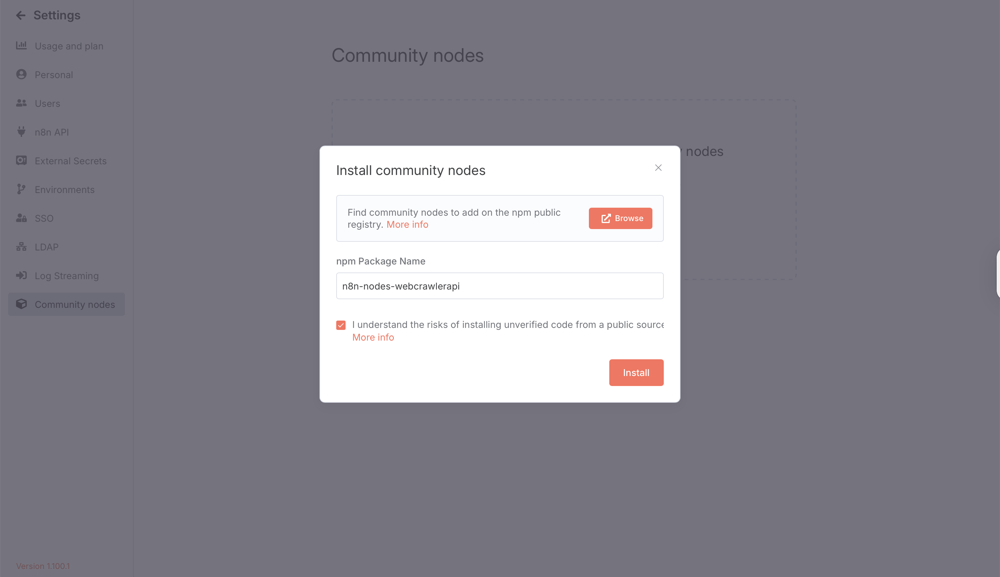
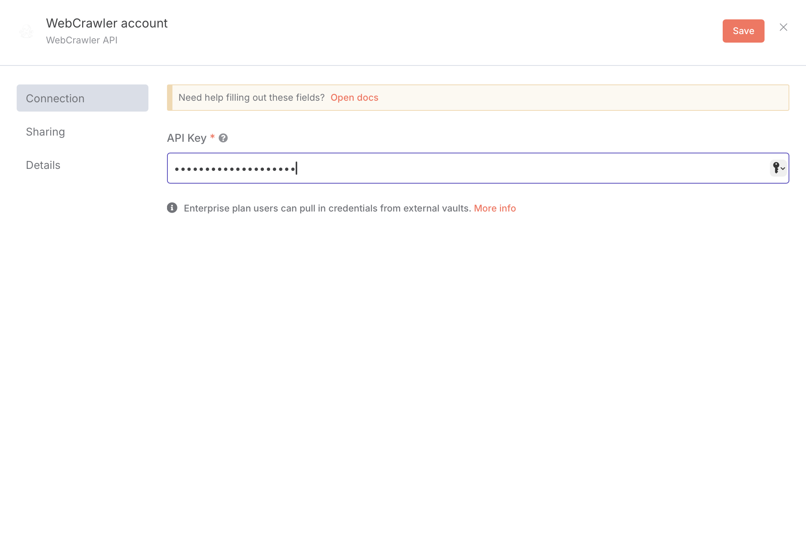

# n8n WebCrawler API Node

WebcrawlerAPI is a website to markdown API for LLM and RAG. You can get content of the website or a single page with a
simple API call. Check more at [WebCrawlerAPI](https://webcrawlerapi.com/). Our docs are available at [WebCrawlerAPI Docs](https://webcrawlerapi.com/docs).

This package contains n8n community nodes for integrating with WebCrawler API.

## Nodes

### WebCrawlerAPI Node

The **WebCrawlerAPI** node allows you to scrape web content using the [WebCrawlerAPI](https://webcrawlerapi.com/) service.

#### Features
- Scrape content from any URL using the `/v2/scrape` endpoint
- Choose output format: Markdown, Cleaned, or HTML
- Remove unwanted elements using CSS selectors
- Use AI-powered prompts to extract specific information from the page

#### Credentials
To use this node, you need a WebCrawlerAPI credential:
- **API Key**: Obtain from [WebCrawlerAPI Dashboard](https://dash.webcrawlerapi.com/access)

#### Parameters
- **URL to scrape** (required): The URL of the page to scrape
- **Output format** (optional): Markdown (default), Cleaned, or HTML
- **CSS selectors to remove** (optional): Comma-separated list of selectors (e.g., `.ads, .popup, #sidebar`)
- **Prompt** (optional): AI prompt to extract specific information

#### Response Fields
- `success`: Boolean indicating if the request was successful
- `status`: Status of the scraping operation
- `markdown`: Content formatted as Markdown
- `cleaned_content`: Cleaned text content
- `raw_content`: Raw HTML content
- `page_title`: Title of the scraped page

#### Example Usage
1. Add the WebCrawlerAPI node to your workflow

2. Configure your WebCrawlerAPI credentials. Get your API key [here](https://dash.webcrawlerapi.com/access).

3. Set the URL you want to scrape
4. Optionally, choose output format, add CSS selectors, or a prompt
5. Execute the workflow

#### Installation

```bash
npm install n8n-nodes-webcrawlerapi
```

#### Development

```bash
# Install dependencies
npm install

# Build the package
npm run build

# Run in development mode
npm run dev
```

## License

MIT
